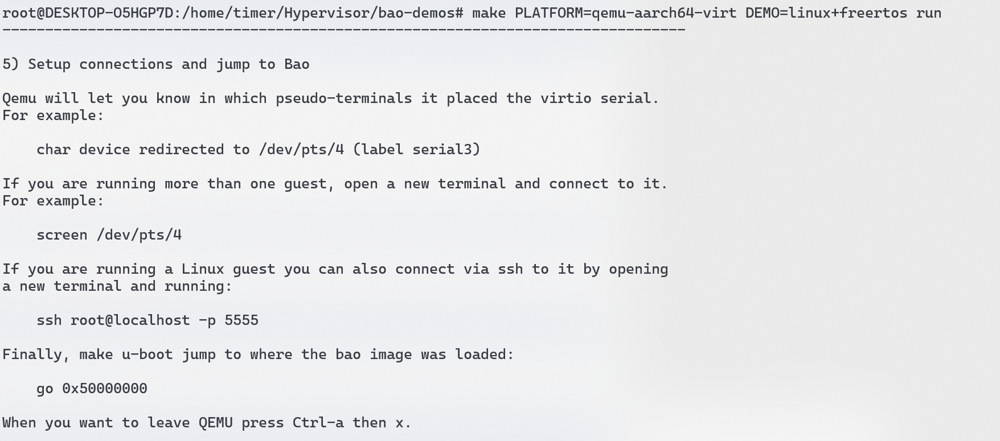
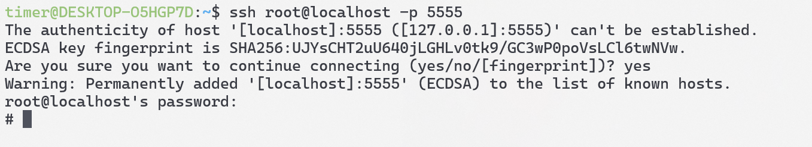
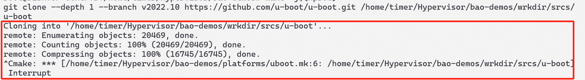

# 一 Bao Hypervisor 环境搭建与运行

官网：[Bao Project](https://github.com/bao-project)

## 1.1 环境准备

个人环境：

- 宿主机：`wsl2 ubuntu20.04`

- 编译器：[Arm GNU Toolchain Downloads – Arm Developer](https://developer.arm.com/downloads/-/arm-gnu-toolchain-downloads)

  

软件依赖：

```shell
sudo apt-get update
sudo apt install build-essential bison flex git libssl-dev ninja-build \
    u-boot-tools pandoc libslirp-dev pkg-config libglib2.0-dev libpixman-1-dev \
    gettext-base curl xterm cmake python3-pip xilinx-bootgen

pip3 install pykwalify packaging pyelftools
```

## 1.2 编译运行

1.先进入`root`模式

```shell
sudo su
```

2.需要设置`CROSS_COMPILE`为你自己的编译器的目录，使用`qemu-aarch64-virt`作为运行soc，运行`linux`加上`freertos`

```shell
export CROSS_COMPILE=/path/to/toolchain/install/dir/bin/your-toolchain-prefix-
export PLATFORM=qemu-aarch64-virt
export DEMO=linux+freertos
```

3.代码仓库下载

```shell
git clone https://github.com/bao-project/bao-demos
cd bao-demos
```

4.编译，需要花点时间

```shell
make -j$(nproc)
```


5.运行

```shell
make PLATFORM=qemu-aarch64-virt DEMO=linux+freertos run
```

启动后有如下的提示：



我们运行了`Linux+FreeRtos`，可以`go 0x50000000`跳转到`bao`的`image`执行，这里应该是运行的`freertos`


新开一个终端通过`ssh root@localhost -p 5555`来进入`Linux`



用户名和密码都是`root`


`/dev/baoipc0`是FreeRtos和Linux的共享内存的文件描述符，可以向此设备写入数据，FreeRtos那边会进行打印

```shell
echo "Hello, Bao!" > /dev/baoipc0
```


## 1.3 问题记录


- 进`root`模式编译，看网上是wsl2编译`BuildRoot`的问题



- 下载`uboot`总是下载不下来，网络不行，按照网上的教程设置一下`git`，百度一下这个错误就好


- 第二次通过`ssh root@localhost -p 5555`进入`Linux`时，会进不去，这是ssh的原因，他其实给出了解决办法，输入`remove with`下面的指令即可

  ```shell
  ssh-keygen -f "/home/timer/.ssh/known_hosts" -R "[localhost]:5555"
  ```

## 参考链接

- [bao-demos构建与与运行逻辑 | Personal Blog](https://zq.org.edu.kg/2024/01/05/bao-demos构建与与运行逻辑/)
- [Bao Hypervisor移植与验证 - clark.yang - Confluence](https://autocore.atlassian.net/wiki/spaces/~712020c17ba14ea02d499a9b11861fe945a652/blog/2023/10/27/324538457/Bao+Hypervisor)

# 二 Bao 项目编译框架

项目的工程目录如下：


上面的编译过程是通过主目录这个`Makefile`来控制的，编译我们传入的参数如下：

```shell
export CROSS_COMPILE=/path/to/toolchain/install/dir/bin/your-toolchain-prefix-
export PLATFORM=qemu-aarch64-virt
export DEMO=linux+freertos
```

这些参数都会被此`Makefile`用到，主`Makefile`会去包含`paltform`目录下的`Makefile`

```makefile
bao_demos:=$(abspath .)
platform_dir:=$(bao_demos)/platforms/$(PLATFORM)
demo_dir:=$(bao_demos)/demos/$(DEMO)
SHELL:=/bin/bash
ifeq ($(wildcard $(platform_dir)),)
 $(error Target platform $(PLATFORM) is not supported)
endif
ifeq ($(wildcard $(demo_dir)),)
 $(error Target demo $(DEMO) is not supported)
endif
include $(platform_dir)/make.mk
include $(demo_dir)/make.mk
```


我们使用的就是`platform/qemu-aarch64-virt/`目录下这个`makefile`

```makefile
ARCH:=aarch64

include $(bao_demos)/platforms/qemu.mk

include $(bao_demos)/platforms/uboot.mk
uboot_defconfig:=qemu_arm64_defconfig
uboot_cfg_frag:="CONFIG_SYS_TEXT_BASE=0x60000000\nCONFIG_TFABOOT=y\n"
uboot_image:=$(wrkdir_plat_imgs)/u-boot.bin
$(eval $(call build-uboot, $(uboot_image), $(uboot_defconfig), $(uboot_cfg_frag)))

atf_plat:=qemu
atf_targets:=bl1 fip 
atf_flags+=BL33=$(wrkdir_plat_imgs)/u-boot.bin
atf_flags+=QEMU_USE_GIC_DRIVER=QEMU_GICV3
include $(bao_demos)/platforms/atf.mk

atf-fip:=$(wrkdir_plat_imgs)/flash.bin
$(atf-fip): $(uboot_image) $(atf_src)
	$(MAKE) -C $(atf_src) PLAT=$(atf_plat) $(atf_targets) $(atf_flags)
	dd if=$(atf_src)/build/qemu/release/bl1.bin of=$(atf-fip)
	dd if=$(atf_src)/build/qemu/release/fip.bin of=$(atf-fip) seek=64 bs=4096 conv=notrunc


platform: $(bao_image) $(atf-fip) 

instuctions:=$(bao_demos)/platforms/$(PLATFORM)/README.md
run: qemu platform
	$(call print-instructions, $(instuctions), 1, false)
	@$(qemu_cmd) -nographic\
		-M virt,secure=on,virtualization=on,gic-version=3 \
		-cpu cortex-a53 -smp 4 -m 4G\
		-bios $(atf-fip)\
		-device loader,file="$(bao_image)",addr=0x50000000,force-raw=on\
		-device virtio-net-device,netdev=net0\
		-netdev user,id=net0,net=192.168.42.0/24,hostfwd=tcp:127.0.0.1:5555-:22\
		-device virtio-serial-device -chardev pty,id=serial3 -device virtconsole,chardev=serial3
	

.PHONY: run
```

在主目录下的`makefile`中定义了：

```makefile
all: platform 
```

假设我们执行`make`命令，那么会先去执行`platform`即此`makefile`中定义的

```makefile
platform: $(bao_image) $(atf-fip) 
```

`platform`目标依赖了两个目标`bao_image`和`atf-fip`，`bao_image`目标是主目录下的`makefile`定义的，目的用于生成`bao.bin`

```makefile
bao_image:=$(wrkdir_demo_imgs)/bao.bin
```


我们再来看`atf-fip`这个目标：为了生成`flash.bin`，依赖`uboot_image`和`atf_src`


先看`atf_src`

```makefile
atf_plat:=qemu
atf_targets:=bl1 fip 
atf_flags+=BL33=$(wrkdir_plat_imgs)/u-boot.bin
atf_flags+=QEMU_USE_GIC_DRIVER=QEMU_GICV3
include $(bao_demos)/platforms/atf.mk
```

`platform/qemu-aarch64-virt/Makefile`会去包含`$(bao_demos)/platforms/atf.mk`

```makefile
atf_repo:=https://github.com/bao-project/arm-trusted-firmware.git
atf_src:=$(wrkdir_src)/arm-trusted-firmware-$(ARCH)
atf_version:=bao/demo

$(atf_src):
	git clone --depth 1 --branch $(atf_version) $(atf_repo) $(atf_src)

define build-atf
$(strip $1): $(atf_src)
	$(MAKE) -C $(atf_src) bl31 PLAT=$(strip $2) $(strip $3)
	cp $(atf_src)/build/$(strip $2)/release/bl31.bin $$@
endef
```

可以看见`atf_src`目标做的事情是下载`arm-trusted-firmware`到`$(wrkdir_src)/arm-trusted-firmware-$(ARCH)`目录下

我们再回到`platform/qemu-aarch64-virt/Makefile`来看`uboot_image`这个目标


`uboot_image:=$(wrkdir_plat_imgs)/u-boot.bin`这里就是去生成`uboot`的二进制文件，如何编译执行的呢，是通过`$(eval $(call build-uboot, $(uboot_image), $(uboot_defconfig), $(uboot_cfg_frag)))`

这条指令去调用`build-uboot`来实现的，这个指令定义在`uboot.mk`中

```makefile
uboot_repo:=https://github.com/u-boot/u-boot.git
uboot_version:=v2022.10
uboot_src:=$(wrkdir_src)/u-boot

$(uboot_src):
	git clone --depth 1 --branch $(uboot_version) $(uboot_repo) $(uboot_src)

define build-uboot
$(strip $1): $(uboot_src)
	$(MAKE) -C $(uboot_src) $(strip $2)
	echo $(strip $3) >> $(uboot_src)/.config
	$(MAKE) -C $(uboot_src) -j$(nproc) 
	cp $(uboot_src)/u-boot.bin $$@
endef

u-boot: $(wrkdir_plat_imgs)/u-boot.bin
```

此`Makefile`会去下载`2022.10`版本的`uboot`，然后定义一个`build-uboot`的指令，结合上面的call传入的参数去编译执行

ok我们再回到`platform/qemu-aarch64-virt/Makefile`

```makefile
atf-fip:=$(wrkdir_plat_imgs)/flash.bin
$(atf-fip): $(uboot_image) $(atf_src)
	$(MAKE) -C $(atf_src) PLAT=$(atf_plat) $(atf_targets) $(atf_flags)
	dd if=$(atf_src)/build/qemu/release/bl1.bin of=$(atf-fip)
	dd if=$(atf_src)/build/qemu/release/fip.bin of=$(atf-fip) seek=64 bs=4096 conv=notrunc
```

这里会去编译`arm-trusted-firmware`，然后把`arm-trusted-firmware`的固件通过`dd`命令合并成`flash.bin`

到此我们已经编译生成了`flash.bin`和`uboot.bin`，现在回到主目录下的`makefile`，现在要来看`bao_image`这个目标

```makefile
bao $(bao_image): $(guest_images) $(bao_cfg) $(bao_src) 
	$(MAKE) -C $(bao_src)\
		PLATFORM=$(PLATFORM)\
		CONFIG_REPO=$(bao_cfg_repo)\
		CONFIG=$(DEMO) \
		CPPFLAGS=-DBAO_DEMOS_WRKDIR_IMGS=$(wrkdir_demo_imgs)
	cp $(bao_src)/bin/$(PLATFORM)/$(DEMO)/bao.bin $(bao_image)
```

`bao_image`以来了`guest_images`、`bao_cfg`、`bao_src`这三个目标，`guest_images`实际上就是去编译生成两个os的image，即`linux`和 `freertos`，`bao_cfg`、`bao_src`这两个目标就是去仓库下载`bao`的源码，然后通过下面的指令编译生成`bao.bin`，至此我们生成的文件有：`bao.bin`、`uboot.bin`、`flash.bin`、`freertos.bin`、`linux.bin`，编译完成后我们是通过`make run`指令来运行的，`run`这个目标定义在`platform/qemu-aarch64-virt/Makefile`里


# 三 TimHyper框架搭建

## 3.1 项目框架搭建

在分析完毕`Bao`的项目框架之后，我们就可以来搭建自己的项目框架了，我们的目标是探究`arm`架构下的虚拟化，因此其他平台的我们直接摒弃。使用`qemu-aarch64-virt`来作为实验平台，简化后的代码项目框架如下：


- `doc`目录为文档目录
- `wkdir`为代码目录，会由`Makefile`来创建

在`Bao`这个`Hypervisor`跑起来之前，对于`arm`架构需要运行两个重要的固件，一个是`atf-a`，一个是`uboot`，关于这两个固件的实现机制这里不做阐述，可以百度学习，只要知道在最终运行启动`Bao`之前，需要先运行`atf-a`再运行`uboot`，因此我们需要去下载源码编译生成固件。源码下载和编译的过程我都参考着写在了`Makefile`中

首先是`atf-a`的`Makefile`：

```makefile
# atf.mk
atf_repo:=https://github.com/bao-project/arm-trusted-firmware.git
atf_src:=$(wrkdir_src)/arm-trusted-firmware-$(ARCH)
atf_version:=bao/demo

$(atf_src):
	git clone --depth 1 --branch $(atf_version) $(atf_repo) $(atf_src)

```

然后是`uboot`的`Makefile`：

```makefile
# uboot.mk
uboot_repo:=https://github.com/u-boot/u-boot.git
uboot_version:=v2022.10
uboot_src:=$(wrkdir_src)/u-boot

$(uboot_src):
	git clone --depth 1 --branch $(uboot_version) $(uboot_repo) $(uboot_src)


define build-uboot
$(strip $1): $(uboot_src)
	$(MAKE) -C $(uboot_src) $(strip $2)
	echo $(strip $3) >> $(uboot_src)/.config
	$(MAKE) -C $(uboot_src) -j$(nproc) 
	cp $(uboot_src)/u-boot.bin $$@
endef

u-boot: $(wrkdir_plat_imgs)/u-boot.bin
```

最后是主目录下的`Makefile`：

```makefile
SHELL:=bash
ARCH=aarch64
TimHyper:=$(abspath .)

CROSS_COMPILE:=/home/timer/arm-toolchain/arm-gnu-toolchain-13.3.rel1-x86_64-aarch64-none-elf/bin/aarch64-none-elf-

wrkdir:=$(TimHyper)/wkdir
wrkdir_src:=$(wrkdir)/srcs
wrkdir_bin:=$(wrkdir)/bin
wrkdir_imgs:=$(wrkdir)/imgs
wrkdir_plat_imgs:=$(wrkdir_imgs)

wrkdirs=$(wrkdir) $(wrkdir_src) $(wrkdir_bin) $(wrkdir_plat_imgs) 

# 创建工作文件夹
ifeq ($(filter clean distclean, $(MAKECMDGOALS)),)
$(shell mkdir -p $(wrkdirs))
endif

# 编译uboot
include ./uboot.mk
uboot_defconfig:=qemu_arm64_defconfig
uboot_cfg_frag:="CONFIG_SYS_TEXT_BASE=0x60000000\nCONFIG_TFABOOT=y\n"
uboot_image:=$(wrkdir_plat_imgs)/u-boot.bin
$(eval $(call build-uboot, $(uboot_image), $(uboot_defconfig), $(uboot_cfg_frag)))

# 编译ATF-A
include ./atf.mk
atf_plat:=qemu
atf_targets:=bl1 fip 
atf_flags+=BL33=$(wrkdir_plat_imgs)/u-boot.bin
atf_flags+=QEMU_USE_GIC_DRIVER=QEMU_GICV3

atf-fip:=$(wrkdir_plat_imgs)/flash.bin
$(atf-fip): $(atf_src) $(uboot_image) 
	$(MAKE) -C $(atf_src) PLAT=$(atf_plat) $(atf_targets) $(atf_flags) 
	dd if=$(atf_src)/build/qemu/release/bl1.bin of=$(atf-fip)
	dd if=$(atf_src)/build/qemu/release/fip.bin of=$(atf-fip) seek=64 bs=4096 conv=notrunc

platform: $(atf-fip)

qemu_arch:=$(ARCH)
qemu_cmd:=qemu-system-$(qemu_arch)

#运行qemu
run: platform
	@$(qemu_cmd) -nographic\
		-M virt,secure=on,virtualization=on,gic-version=3 \
		-cpu cortex-a53 -smp 4 -m 4G\
		-bios $(atf-fip)\

distclean:
	rm -rf $(wrkdir)

.PHONY: run
```

## 3.2  启动测试

在主目录下执行`make platform`命令，会去自动下载`atf-a`和`uboot`的源码，然后执行编译操作，最后会将这两个固件打包成`flash.bin`，放在`wkdir/imgs/`目录下，最后我们执行`make run`指令来启动`qemu`：


通过启动的日志我们可以看见启动分为了好几个阶段


这里的`bl33`就是`uboot`，`kernel`这里还没有引入，可以认为，我们后续需要分析的`Bao`就是`kernel`，它是由`uboot`来引导启动的。把`uboot`配置为`atf-a`的`bl33`是在编译时指定的：

```makefile
atf_flags+=BL33=$(wrkdir_plat_imgs)/u-boot.bin
```

`qemu`的退出指令为`ctrl + a, x`

## 参考链接

- [【ATF】TF-A概述 - Emma1111 - 博客园](https://www.cnblogs.com/Wangzx000/p/17792870.html)

- [《STM32MP157嵌入式Linux驱动开发指南》第七章 TF-A初探 - 知乎](https://zhuanlan.zhihu.com/p/377835542)

- [万字长文带你搞懂安全启动及ATF_atf是如何启动的-CSDN博客](https://blog.csdn.net/u012294613/article/details/134811897)
