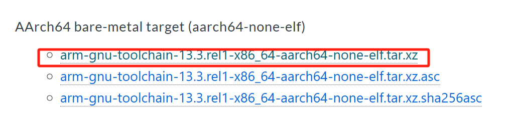
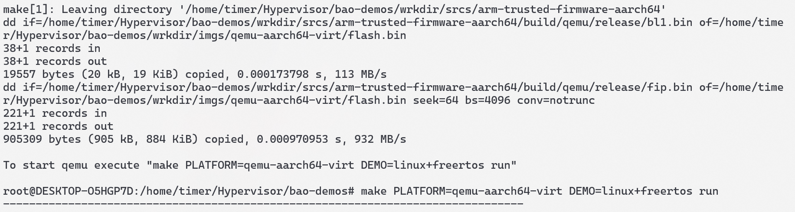
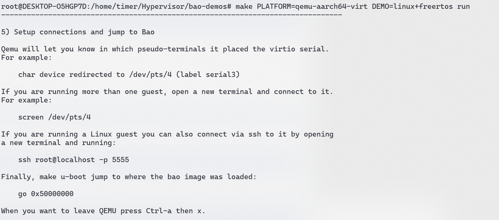
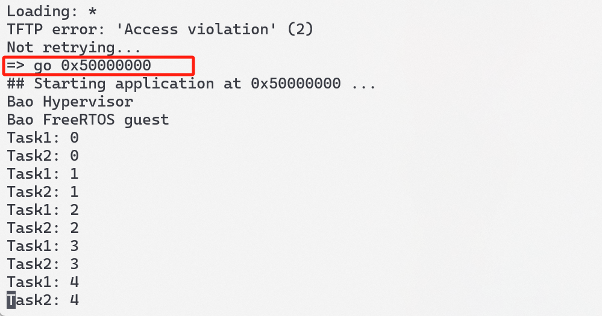
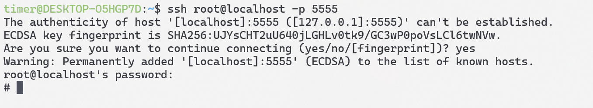
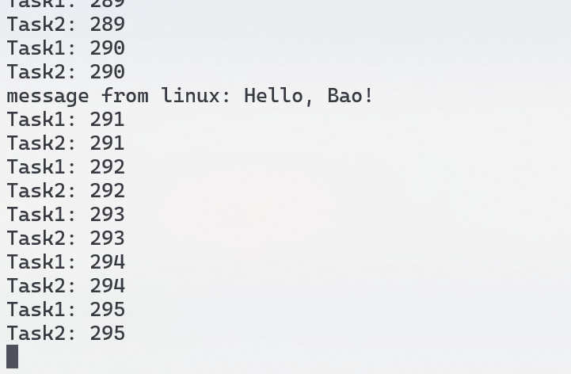
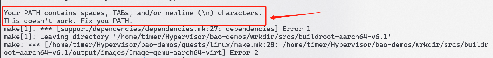
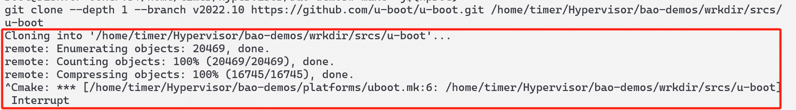
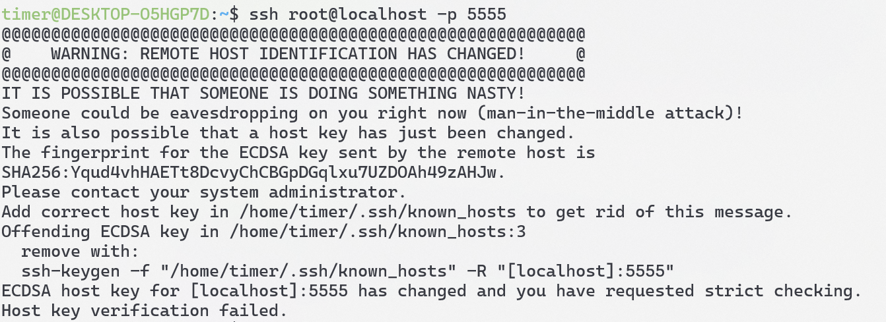

# 一 Bao Hypervisor 环境搭建与运行

官网：[Bao Project](https://github.com/bao-project)

## 1.1 环境准备

个人环境：

- 宿主机：`wsl2 ubuntu20.04`

- 编译器：[Arm GNU Toolchain Downloads – Arm Developer](https://developer.arm.com/downloads/-/arm-gnu-toolchain-downloads)

  

软件依赖：

```shell
sudo apt-get update
sudo apt install build-essential bison flex git libssl-dev ninja-build \
    u-boot-tools pandoc libslirp-dev pkg-config libglib2.0-dev libpixman-1-dev \
    gettext-base curl xterm cmake python3-pip xilinx-bootgen

pip3 install pykwalify packaging pyelftools
```

## 1.2 编译运行

1.先进入`root`模式

```shell
sudo su
```

2.需要设置`CROSS_COMPILE`为你自己的编译器的目录，使用`qemu-aarch64-virt`作为运行soc，运行`linux`加上`freertos`

```shell
export CROSS_COMPILE=/path/to/toolchain/install/dir/bin/your-toolchain-prefix-
export PLATFORM=qemu-aarch64-virt
export DEMO=linux+freertos
```

3.代码仓库下载

```shell
git clone https://github.com/bao-project/bao-demos
cd bao-demos
```

4.编译，需要花点时间

```shell
make -j$(nproc)
```



5.运行

```shell
make PLATFORM=qemu-aarch64-virt DEMO=linux+freertos run
```

启动后有如下的提示：



我们运行了`Linux+FreeRtos`，可以`go 0x50000000`跳转到`bao`的`image`执行，这里应该是运行的`freertos`



新开一个终端通过`ssh root@localhost -p 5555`来进入`Linux`



用户名和密码都是`root`


`/dev/baoipc0`是FreeRtos和Linux的共享内存的文件描述符，可以向此设备写入数据，FreeRtos那边会进行打印

```shell
echo "Hello, Bao!" > /dev/baoipc0
```




## 1.3 问题记录



- 进`root`模式编译，看网上是wsl2编译`BuildRoot`的问题



- 下载`uboot`总是下载不下来，网络不行，按照网上的教程设置一下`git`，百度一下这个错误就好



- 第二次通过`ssh root@localhost -p 5555`进入`Linux`时，会进不去，这是ssh的原因，他其实给出了解决办法，输入`remove with`下面的指令即可

  ```shell
  ssh-keygen -f "/home/timer/.ssh/known_hosts" -R "[localhost]:5555"
  ```

## 参考链接

- [bao-demos构建与与运行逻辑 | Personal Blog](https://zq.org.edu.kg/2024/01/05/bao-demos构建与与运行逻辑/)
- [Bao Hypervisor移植与验证 - clark.yang - Confluence](https://autocore.atlassian.net/wiki/spaces/~712020c17ba14ea02d499a9b11861fe945a652/blog/2023/10/27/324538457/Bao+Hypervisor)